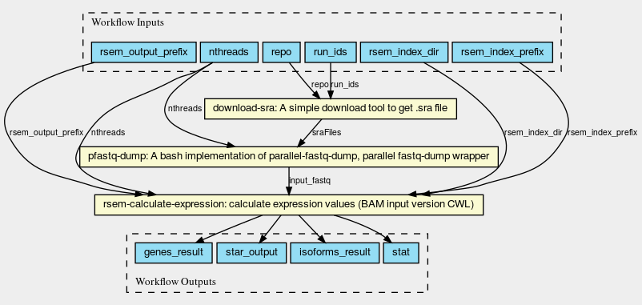

# RNAseq readcount workflow

This repository contains the scripts and the [Common Workflow Language](https://commonwl.org) definition files of the RNA-Seq quantification workflow. The workflow is designed to perform the gene expression analysis for human/mouse RNA-Seq data using [STAR](https://github.com/alexdobin/STAR) and [RSEM](https://github.com/deweylab/RSEM). We modified the RSEM script `rsem-calculate-expression` to change input parameters to STAR command along with the [ENCODE project standard](https://www.encodeproject.org/pipelines/ENCPL002LSE/) which is published at [inutano/RSEM](https://github.com/inutano/RSEM).

To run the workflow, we highly recommend to use [CWL version](analysis/processing/readcount/cwl) of the workflow. See the [README](analysis/processing/readcount/cwl/README.md) for the instruction to run the CWL workflow.

Note that the workflow requires >32GB memory for human/mouse RNA-Seq data.

## Workflow steps



The image is drawn by [view.commonwl.org](https://view.commonwl.org)

## Prerequisites

- g++
- make
- zlib
- git
- [lftp](https://lftp.yar.ru) and fast internet connection
- [NCBI SRA tools](https://github.com/ncbi/sra-tools/wiki/Downloads)

## Install

All users are highly recommended to use [Docker](https://www.docker.com) or [Singularity](https://singularity.lbl.gov) container which allows users to run the workflow without installing the required software components. If you have a special reason not to use containers, use [`analysis/processing/readcount/batch_script/install.sh`](analysis/processing/readcount/batch_script/install.sh).

```
$ git clone https://github.com/inutano/sra-star-rsem
$ cd sra-star-rsem
$ bash ./analysis/processing/readcount/batch_script/install.sh
```

This will install the binaries in `$HOME/.readcount/bin`. To change the installation target, use `--prefix` to specify the directory. For example, `--prefix $HOME/software` will install binaries in `$HOME/software/bin`.

## Quick start

Use scripts in `analysis/processing/readcount/batch_script/script`.

### Fetch and Run

Fetch data from NCBI:

```
$ download_sra.sh --database ncbi --experiment-id SRX534534 --outdir $(pwd)
```

Run STAR/RSEM:

```
$ rnaseq_readcount.sh -j conf_example.sh -f SRR1274306.sra,SRR1274307.sra -x SRX534534
```

### Bulk execution

```
$ bulk_rnaseq_readcount.sh -j bulk_conf_example.sh
```
